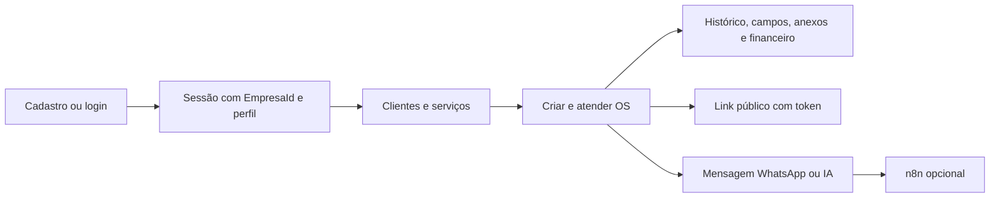

# Auditoria técnica — DirectOS

Data da análise: 05/08/2026. Escopo: estado presente no diretório de trabalho, sem execução contra o banco de dados ou serviços externos. Nenhum arquivo da aplicação foi alterado nesta auditoria.

## Visão geral

DirectOS é um sistema SaaS web para gestão de ordens de serviço. É implementado como um monólito PHP com páginas renderizadas no servidor, persistência em Microsoft SQL Server e isolamento lógico por empresa (`EmpresaId`). Há uma área pública de acompanhamento da OS por token, administração global de empresas/planos e uma API HTTP pequena para criação de OS por integração externa.

O repositório contém 125 arquivos PHP, 6 scripts SQL, 1 arquivo CSS próprio, Dockerfile, configuração Render e Composer. Não há `package.json`, lockfile JavaScript, `docker-compose.yml`, testes automatizados ou pipeline de CI versionados.

> Observação de escopo: já existiam mudanças locais não relacionadas à auditoria em `planos/alterar.php`, no diretório `api/` e em `directos-saas.zip`. Elas foram preservadas. A API foi descrita por estar presente no diretório de trabalho, mas `api/` ainda não está rastreado pelo Git neste snapshot.

## Estrutura de pastas

| Caminho | Papel identificado |
| --- | --- |
| `admin/` | Backoffice de SuperAdmin: empresas, implantação, planos, assinaturas, métricas, solicitações, auditoria e diagnóstico. |
| `api/` | API JSON: health check e criação de OS. |
| `assets/css/` | Estilo próprio (`directos.css`). |
| `config/` | Constantes da aplicação, carregamento de `.env` e conexão PDO SQL Server. |
| `includes/` | Componentes compartilhados: layout, autenticação, CSRF, escopo de empresa, planos, auditoria, IA, n8n, anexos e histórico. |
| `clientes/`, `servicos/`, `usuarios/` | Telas e handlers de CRUD por empresa. |
| `ordens/` | Núcleo de OS: CRUD, atendimento, histórico, anexos, recebimentos, recibos, mensagens, IA e n8n. |
| `campos_os/` | Campos personalizados e modelos por segmento. |
| `relatorios/` | Relatórios de OS e financeiro, com exportação CSV. |
| `empresa/`, `configuracoes/`, `planos/` | Administração da empresa atual, onboarding/integrações/segmento e solicitações de plano. |
| `public/` | Acompanhamento público de OS e anexos liberados ao cliente. |
| `database/` | DDL, alterações, dados de demonstração e documentação do banco. |
| `docs/` | Material operacional/comercial e de deploy. |
| `uploads/`, `logs/` | Diretórios de dados locais, mantidos com `.gitkeep`. |
| `apache/` | VirtualHost Apache para o container. |

Na raiz estão as páginas públicas/iniciais (`index.php`, cadastro, login, dashboard), os arquivos de deploy (`Dockerfile`, `docker-entrypoint.sh`, `render.yaml`) e `composer.json`.

## Tecnologias e dependências realmente presentes

- PHP 8.3: requisito do Composer e imagem `php:8.3-apache-bookworm`.
- Apache HTTP Server com `mod_rewrite` habilitado no Docker.
- Microsoft SQL Server, via PDO e driver `pdo_sqlsrv`; a imagem instala `msodbcsql18`, `sqlsrv` e `pdo_sqlsrv`.
- HTML renderizado no servidor, CSS próprio e JavaScript inline por página.
- Bootstrap 5.3.3 carregado via CDN (CSS e bundle JavaScript).
- cURL PHP para chamadas à API OpenAI e a webhooks n8n.
- Composer existe, mas declara somente a plataforma PHP 8.3; não declara bibliotecas de terceiros e não há `composer.lock` nem `vendor/` versionado.
- Não há gerenciador de dependências JavaScript, pacote npm, framework JavaScript, ORM, framework PHP, Docker Compose ou biblioteca de gráficos identificados.

## Arquitetura

O sistema adota uma arquitetura monolítica, procedural e orientada a páginas:

1. Cada URL PHP combina controller, consulta SQL e view na mesma unidade.
2. Handlers de gravação recebem formulários POST e redirecionam de volta às telas.
3. `includes/` concentra guardas, funções auxiliares e layouts; `config/conexao.php` cria uma conexão PDO global (`$conn`).
4. Consultas usam predominantemente statements preparados com parâmetros nomeados.
5. Os dados são segregados pela coluna `EmpresaId`, tomada da sessão em rotinas autenticadas.
6. A API JSON não usa a sessão web: autentica com chave no cabeçalho e opera diretamente no banco.

Não há camadas formais de rotas, controllers, models, services, injeção de dependência ou migrações automatizadas.

## Banco de dados e scripts SQL

O banco é SQL Server. O script-base `database/001_schema_inicial.sql` define as tabelas abaixo:

- `OS_Empresas`, `OS_Usuarios`, `OS_Planos`, `OS_Assinaturas`;
- `OS_Clientes`, `OS_Servicos`, `OS_OrdensServico`;
- `OS_Historico` e `OS_OrdensServicoHistorico`;
- `OS_CamposPersonalizados` e `OS_OrdensServicoCampos`;
- `OS_OrdensServicoAnexos`, `OS_MensagensWhatsApp`, `OS_Recebimentos` e `OS_Auditoria`;
- `PortfoliioEmpresa` (nome exatamente como consta no DDL, sem uso encontrado no PHP).

Scripts adicionais:

| Script | Conteúdo |
| --- | --- |
| `001_schema_inicial.sql` | Estrutura base, defaults e algumas chaves estrangeiras. |
| `002_alteracoes_publicacao_mvp.sql` | Alterações do MVP: segmento, campos personalizados, dados/visibilidade de OS, financeiro, recebimentos e índices. |
| `003_dados_demo.sql` | Limpa e recria dados de demonstração; é destrutivo para a empresa demo. |
| `004_atualiza_planos_comerciais.sql` | Cria/atualiza planos Starter, Profissional e Empresa. |
| `005_plano_teste_assistido.sql` | Cria/atualiza o plano gratuito Teste Assistido. |
| `006_solicitacoes_planos.sql` | Cria `OS_SolicitacoesPlano` e seus índices. |

O README interno de `database/` lista uma ordem de execução até o script 005; portanto, não inclui o script 006 mais recente. Os scripts não formam uma cadeia de migrações controlada por ferramenta.

### Divergências verificáveis entre código e DDL versionado

- O PHP usa `OS_Empresas.PlanoId` em planos, área pública e administração. Essa coluna não aparece na definição de `OS_Empresas` nem em um `ALTER TABLE` nos seis scripts SQL versionados.
- `api/ordens/criar.php` consulta e insere em `DirectTI_IntegracoesOS`; não há DDL dessa tabela no repositório.
- As poucas FKs declaradas no schema vinculam `OS_Historico` e cliente/serviço de OS. Não foram encontradas FKs versionadas para a maior parte das relações por empresa, planos, anexos, recebimentos e campos personalizados.

Assim, uma instalação apenas com os scripts rastreados pode não corresponder ao schema esperado pelo código atual. A estrutura efetiva do banco em produção deve ser extraída e reconciliada antes de uma instalação nova.

## Autenticação, autorização e SaaS

### Autenticação

- Login por e-mail e senha em `validar_login.php`.
- Senhas são verificadas com `password_verify`; cadastros e criação de usuários usam `password_hash(..., PASSWORD_DEFAULT)`.
- A sessão armazena `UsuarioId`, nome, e-mail, perfil, `EmpresaId` e nome da empresa.
- `includes/proteger.php` exige sessão, empresa e perfil; também confirma que a empresa segue ativa no banco a cada página protegida.
- Há logout por destruição de sessão e tokens CSRF para formulários POST e ações GET que os utilizam.

### Papéis e permissões

Os perfis encontrados são `SuperAdmin`, `Admin`, `Atendente` e `Tecnico`.

- `SuperAdmin`: área `admin/`, visão global de empresas, planos, assinaturas, métricas, auditoria, implantações e solicitações.
- `Admin`: gestão da empresa e de usuários; é o perfil exigido por alguns handlers com `proteger_admin.php`.
- `Atendente` e `Tecnico`: reconhecidos por `usuarioPodeAtenderOS()` para atendimento de OS.
- A aplicação usa `exigirPerfil`, `usuarioPodeGerenciar` e verificações diretas de perfil em páginas/handlers. Não há ACL em banco nem permissões granulares por ação.

### Multiempresa e planos

O modelo é multiempresa por compartilhamento de banco e segregação lógica com `EmpresaId` nas entidades operacionais. `includes/seguranca.php` valida que cliente, serviço, OS, anexo e usuário pertencem à empresa da sessão. As consultas principais também filtram `EmpresaId`.

Os planos possuem limites mensais de OS e usuários, além de flags para anexos, área pública do cliente e WhatsApp. `includes/planos.php` aplica esses limites ao criar OS/usuários e bloqueia recursos de plano. Assinaturas registram o histórico de plano; o código dá preferência ao `PlanoId` da empresa e usa a última assinatura ativa como fallback para empresas antigas.

## Módulos e funcionalidades implementadas

| Módulo | Evidência funcional |
| --- | --- |
| Onboarding/cadastro | Criação de empresa, usuário administrador e dados iniciais; telas de sucesso e configuração inicial. |
| Clientes | Cadastro, listagem, edição, atualização e exclusão no escopo da empresa. |
| Serviços | CRUD, valor-base e checklist padrão; assistência de IA para descrição/checklist. |
| Ordens de serviço | Criação, edição, listagem com filtros, visualização, status/prioridade, solução, valores, datas e exclusão. |
| Histórico e atendimento | Registro de alterações/status, atendimento e controle de visibilidade ao cliente. |
| Campos personalizados | CRUD de campos, preenchimento por OS e modelos por segmento. |
| Anexos | Upload, abertura, remoção e alternância de visibilidade pública, sujeitos ao plano. |
| Financeiro | Status financeiro, recebimentos parciais, exclusão de recebimento, recibo da OS e recibo por pagamento. |
| Relatórios | Relatórios operacional e financeiro, filtros, agregações e exportação CSV. |
| Área do cliente | Consulta pública por `TokenAcompanhamento`, com controles de exibição de valor, solução, histórico e anexos. |
| WhatsApp | Mensagens preparadas/manual via `wa.me`, histórico de mensagens e envio opcional para n8n. |
| IA | Resumo de OS, sugestão de prioridade, checklist técnico, mensagens para WhatsApp e assistência em serviços. |
| Configurações | Dados da empresa, segmento, onboarding e página/teste de integrações. |
| Planos | Exibição/solicitação de alteração pela empresa e aprovação/reprovação administrativa. |
| Administração global | Empresas, status, planos, assinaturas, implantações, métricas, auditoria e diagnóstico. |
| Demo | Dados fictícios e bloqueios de algumas ações por `includes/demo.php`. |

## Fluxos principais

- Cadastro: formulário protegido por CSRF cria empresa, administrador, plano/assinatura conforme o fluxo e registra auditoria.
- Operação: usuário autenticado trabalha apenas com registros da `EmpresaId` de sessão; a criação de OS e usuários consulta o limite do plano.
- Acompanhamento: a OS recebe token UUID; `public/os.php` usa o token e as flags do plano/OS para exibir dados e anexos liberados.
- Financeiro: recebimentos são associados à OS e recalculam o status financeiro; recibos podem ser gerados para OS e pagamentos.
- Plano: empresa solicita mudança; SuperAdmin processa a solicitação, atualiza o plano da empresa e registra uma assinatura.

## Integrações e APIs

### Integrações externas

- OpenAI: `includes/ia.php` chama o endpoint configurável (padrão: `/v1/responses`) com Bearer token, quando `IA_ATIVA`, chave e modelo estão configurados. `servicos/assistente_ia.php` possui ainda uma chamada direta ao endpoint legado `/v1/chat/completions`.
- n8n: `includes/n8n.php` envia JSON ao webhook configurado, com `X-DirectOS-Secret`; há tela de teste e handler de envio de mensagem de OS.
- WhatsApp: links `https://wa.me/` para envio manual assistido; não há integração direta com API oficial do WhatsApp no código.
- Render: `render.yaml` descreve deploy Docker, variáveis e disco persistente em `/var/www/storage`.

### API HTTP existente

| Endpoint | Método | Autenticação | Comportamento |
| --- | --- | --- | --- |
| `api/health.php` | qualquer método | `X-DirectTI-Key` | Retorna status JSON simples. |
| `api/ordens/criar.php` | POST | `X-DirectTI-Key` | Recebe JSON, valida empresa/serviço, localiza ou cria cliente, cria OS/histórico e registra vínculo anti-duplicidade por pedido de origem. |

O bootstrap usa `DIRECTTI_API_KEY` do ambiente, mas utiliza uma chave de desenvolvimento fixa quando a variável está ausente. O endpoint `health.php` possui a mesma chave fixa diretamente no código e não reutiliza o bootstrap. Isso deve ser removido antes de expor a API em produção.

## Docker e deploy

- `Dockerfile`: Apache + PHP 8.3 no Debian Bookworm, extensão SQL Server, diretórios persistentes de upload/log e VirtualHost próprio.
- `docker-entrypoint.sh`: define porta e diretórios de dados, ajusta permissões e inicia Apache.
- `render.yaml`: serviço web Docker, deploy automático, plano Starter e volume persistente de 1 GB.
- Há `.dockerignore` e `apache/vhost.conf`.
- Não existe `docker-compose.yml`; portanto, o repositório não provisiona SQL Server local por Compose.

## Recursos planejados, incompletos ou com lacunas observáveis

Estes itens são apontados pelo próprio código/documentação ou por divergência estática — não são funcionalidades inferidas:

- A automação n8n é apresentada nos materiais como opcional/futura, apesar de já haver um webhook implementado; exige configuração externa para funcionar.
- `empresa/editar.php` informa que o slug poderá ser usado futuramente para URL personalizada; hoje o acompanhamento público usa token, não slug.
- `database/ambiente-demo.md` lista como melhorias: bloquear exclusões no demo, restaurar os dados e modo somente leitura. O código possui bloqueios pontuais, mas não há script/botão de restauração nem modo somente leitura completo identificado.
- O relatório financeiro declara que poderá evoluir para contas a receber e pagamentos parciais; pagamentos parciais já existem via recebimentos, mas não foi identificado módulo de contas a receber independente.
- O endpoint de criação de OS depende de `DirectTI_IntegracoesOS`, cuja criação não está versionada.
- O modelo de planos depende de `OS_Empresas.PlanoId`, cuja migração também não está versionada.
- Não foram encontrados testes automatizados, CI, documentação formal da API (OpenAPI), dependências JavaScript gerenciadas ou migrações executáveis por ferramenta.

## Oportunidades de melhoria

1. Reconstruir e versionar o schema real: incluir a migração de `OS_Empresas.PlanoId`, a tabela `DirectTI_IntegracoesOS`, FKs/índices necessários e uma ordem única de migração.
2. Remover a chave padrão da API e unificar a autenticação de todos os endpoints no bootstrap; definir rotação, escopo por integração e limitação de taxa.
3. Centralizar autorização em uma camada única. Hoje perfis e regras se distribuem entre páginas, handlers e `includes/`.
4. Formalizar rotas, controllers e serviços para separar HTML, regras de negócio e acesso SQL; isso reduz duplicação e facilita testes.
5. Adicionar testes de autenticação, isolamento por empresa, limites de plano, acesso público por token e API de criação de OS; incluir CI.
6. Criar especificação e exemplos de contrato para a API, incluindo o schema da integração anti-duplicidade.
7. Completar o modo demo (somente leitura/restauração) ou documentar precisamente as ações bloqueadas.
8. Substituir tipos SQL legados `text` por `varchar(max)`/`nvarchar(max)` em uma migração planejada e ampliar integridade referencial.
9. Consolidar a integração OpenAI: o projeto mistura Responses API configurável e uma chamada direta a Chat Completions.

## Roadmap técnico sugerido

1. **Fundação do banco e deploy:** obter dump/schema do ambiente efetivo; criar migrações idempotentes e versionadas; validar instalação limpa no Docker.
2. **Segurança e API:** eliminar segredo padrão, padronizar middleware de API, registrar/auditar chamadas e publicar contrato da API.
3. **Qualidade:** introduzir testes automatizados e CI com lint PHP, teste de migração e cenários de autorização multiempresa.
4. **Organização do código:** extrair serviços para OS, planos, financeiro e integrações, mantendo o comportamento das páginas atuais.
5. **Produto pendente:** decidir e implementar a automação n8n em produção, URL por slug caso desejada e um modo demo consistente.

